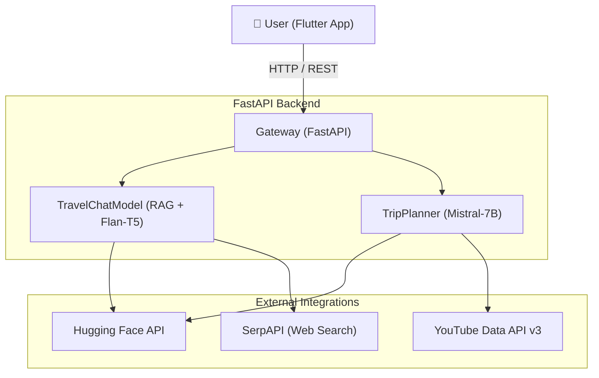

<div align="center">


# 🌍 Wander Lens
### *Your AI-Powered Travel Companion*

*Transform the way you explore the world with personalized, intelligent itineraries and immersive 360° VR previews.*

---

</div>

## ✨ Overview

**Wander Lens** is a next-generation travel planning platform that combines the power of advanced Large Language Models (LLMs) with immersive virtual reality previews. By simply providing your destination, preferences, and budget, Wander Lens crafts personalized, detailed itineraries complete with embedded 360° VR YouTube links, allowing you to *see* your destination before you even pack your bags.

It is designed with a high-performance **FastAPI** backend that dynamically orchestrates data from live web searches, Hugging Face models, and the YouTube API, seamlessly connected to a beautiful **Flutter** frontend interface.

---

## 🚀 Key Features

- **🧠 Intelligent Itinerary Generation:** Powered by open-source LLMs (`Mistral-7B-Instruct` & `Flan-T5`), creating hyper-personalized, day-by-day travel plans based on your specific trip type, budget, and hotel location.
- **🕶️ Immersive VR Integration:** Automatically sources and embeds the best 360° YouTube VR videos for every landmark in your itinerary.
- **💬 Conversational AI Travel Assistant:** A dedicated, context-aware chatbot session to help you discover hidden local gems, top-rated restaurants, and get real-time practical travel advice.
- **📄 AR Menu Previews:** (Experimental) Upload restaurant menus and extract AR model links to visualize your dishes in 3D before ordering!
- **🌐 Real-Time Data Augmentation:** Built-in web scraping (`SerpAPI` & `BeautifulSoup`) to pull the latest reviews, events, and tips from Reddit and TripAdvisor.
- **⚡ High-Performance Architecture:** Robust, scalable, and fully asynchronous RESTful API.

---

## 🏗️ Architecture

Wander Lens utilizes a hybrid architecture combining Retrieval-Augmented Generation (RAG) with multimodal outputs (Text + VR/AR links).



---

## 🛠️ Technology Stack

| Component | Technology | Purpose |
| :--- | :--- | :--- |
| **Backend Framework** | `FastAPI` | Asynchronous API routing, session management, and endpoints. |
| **LLM Inference** | `Hugging Face` | Text generation for itineraries and chat responses. |
| **Video Retrieval** | `Google API` | Fetching immersive 360° VR content for locations. |
| **Web Scraping** | `SerpAPI` & `BeautifulSoup` | Real-time information retrieval (reviews, Reddit threads). |
| **Embeddings/Search** | `SentenceTransformers` | Semantic search and contextual memory mapping. |
| **Frontend** | `Flutter` | Cross-platform, responsive mobile application interface. |

---

## 💻 Installation & Setup

### Prerequisites

- **Python 3.9+**
- **Flutter SDK**
- API Keys Required:
  - Hugging Face Token (`HF_TOKEN`)
  - YouTube Data API Key (`YOUTUBE_API_KEY`)
  - SerpAPI Key (`SERPAPI_KEY`)

### 1️⃣ Backend Setup

```bash
# Clone the repository
git clone https://github.com/kenzzhood/Wander_Lens.git
cd Wander_Lens

# Create and activate a virtual environment
python -m venv venv
source venv/bin/activate  # On Windows: venv\Scripts\activate

# Install dependencies
pip install -r requirements.txt

# Configure Environment Variables
# Create a .env file in the root directory:
echo "HF_TOKEN=your_token_here" >> .env
echo "YOUTUBE_API_KEY=your_key_here" >> .env
echo "SERPAPI_KEY=your_key_here" >> .env
```

### 2️⃣ Running the Microservices

Wander Lens splits its architecture into two specialized local servers:

**Start the Main Itinerary Generator (Port 8002):**
```bash
uvicorn main:app --reload --port 8002
```

**Start the Conversational Context Chatbot (Port 8001):**
```bash
uvicorn Chat:app --reload --port 8001
```

### 3️⃣ Frontend Setup

```bash
# Navigate to the Flutter app directory
cd dummy_flutter_app

# Fetch packages
flutter pub get

# Run the app on your connected device/emulator
flutter run
```

---

## 🌐 API Endpoints Overview

### Main Generator Service (`localhost:8002`)
- **`POST /generate_itinerary`**
  - **Payload:** `{ "location": "Tokyo", "hotel": "Shinjuku", "days": 3, "budget": "Medium", "trip_type": "Cultural" }`
  - **Returns:** A detailed, day-by-day plan with appended `youtube_url` links pointing to 360° VR videos of the locations.

### Chat & AR Service (`localhost:8001`)
- **`POST /start_chat`**: Initializes a new session UUID.
- **`POST /chat`**:
  - Send messages to the AI assistant for contextual travel advice. The system remembers your location and history for 1 hour.
- **`POST /upload_menu/{restaurant_name}`**:
  - Upload a PDF menu. The backend parses it to extract dish items and AR 3D model links for interactive dining.
- **`GET /ar_viewer/{model_id}`**:
  - Serves an AR link for a requested 3D asset.

---

## 🤝 Contributing

We welcome contributions to expand Wander Lens's capabilities!
1. Fork the Project
2. Create your Feature Branch (`git checkout -b feature/AmazingFeature`)
3. Commit your Changes (`git commit -m 'Add some AmazingFeature'`)
4. Push to the Branch (`git push origin feature/AmazingFeature`)
5. Open a Pull Request

---

<div align="center">
  <p>Built for the modern explorer. ✈️</p>
</div>
