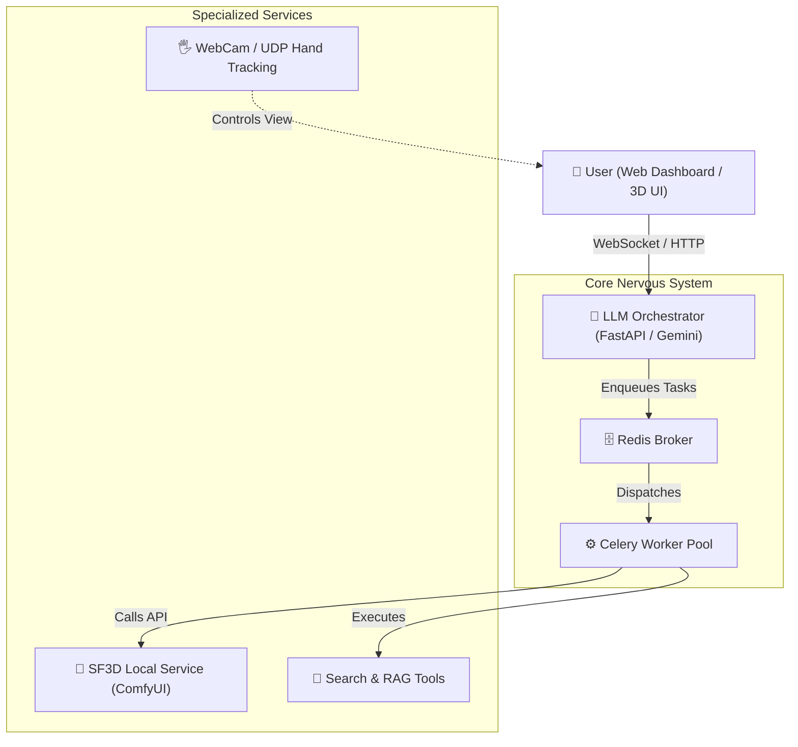

<p align="center">
  
</p>

<h1 align="center">MILES</h1>
<p align="center">
  <strong>Multimodal Intelligent Agent System</strong>
</p>

<p align="center">
  
  
  
  
  
  
</p>

> **MILES** is a next-generation cognitive agent framework leveraging a robust **Microservice Architecture**. It integrates specialized AI capabilities—such as advanced 3D generation and RAG search—under a centralized LLM Orchestrator that "thinks", plans, and executes.

---

## ✨ Features

- 🧠 **Centralized Intelligence Core:** Powered by Gemini 1.5 Pro to intelligently delegate tasks, manage context, and coordinate disparate microservices.
- 🧊 **Accelerated 3D Generation Pipeline:** Fully automated Text-to-3D (Image-to-3D) workflows via **Stable Fast 3D (SF3D)** running as a dedicated local background service. Generates high-quality GLB assets in under 60 seconds with built-in background removal.
- 🖐️ **Holographic 3D Interactive Viewer:** Premium dark-themed UI relying on customized `Three.js` integration, implementing ultra-smooth hand-tracking (via MediaPipe homography) to dynamically rotate, scale, and manipulate 3D models exactingly. 
- 🔎 **Intelligent Deep RAG Strategy:** Real-time factual augmentation using integrated web search to build execution context unavailable in static models.
- ⚡ **Asynchronous Microservice Backbone:** Blazing fast execution built around FastAPI, Celery queues, and Redis for distributed, non-blocking task orchestration.

---

## 🏗️ Architecture

MILES adopts an event-driven, microservices-oriented topology to separate concerns and ensure scalability between the brain, memory, and task execution instances.



### Component Architecture
- `src/orchestrator/`: The core cognitive loop. Processes incoming user context, routes workflow tools, and manages memory limits.
- `src/services/sf3d_service.py`: Dedicated abstraction layer to control the native ComfyUI process serving SF3D queries.
- `src/workers/`: Heavy-lifting Celery processes executing computationally or time-intensive generative pipelines.
- `src/web/`: Aesthetically premium, reactive web frontend and 3D modeling environments.

---

## 🚀 Getting Started

### Prerequisites
- **OS:** Windows 10/11
- **Hardware:** NVIDIA GPU (Recommended: 4GB+ VRAM for continuous local generation; validated on RTX 3050).
- **Core Dependencies:** Local Redis Server instance required and active.

### Installation

1. **Clone the Repository:**
   ```bash
   git clone https://github.com/yourusername/MILES.git
   cd MILES
   ```

2. **Environment Assembly:**
   Deploy the Python specifications using the unified constraints list:
   ```bash
   pip install -r requirements.txt
   ```

3. **Vendor Setup (SF3D Portable):**
   - MILES intrinsically runs operations atop `StableFast3D-WinPortable` localized in `src/libs/SF3D_Portable`.
   - Before firing up, unpack the provided `.7z` so that `run.bat` is resolvable inside the extracted directory root.

4. **Configuration:**
   - Mount your API keys and parameters inside a local `.env` file or hardcode them safely into `src/config.py`.

### Execution Flow

A packaged initialization script seamlessly brings the API, workers, and background generation processes online. 

1. **Spin up MILES:**
   ```bash
   start_miles.bat
   ```
   *This automatically engages and minimizes the Celery background nodes, mounts the overarching FastAPI network, and bridges to the hidden ComfyUI process.*

2. **Engage the Interface:**
   - Navigate to `http://localhost:8000/ui` in your browser.
   - Command tasks using natural language, or explore models leveraging your physical hands!

---

## 🔮 Usage Examples

*Examples to prompt the intelligent orchestrator:*
- *"Ingest this URL and isolate a 3D model of the focal object: `C:\path\to\reference.png`."*
- *"Look up the origin and implementation complexities of MonoSplat."*
- *"Deploy a holographic rendering of a cyberpunk drone; map its engine specs based on theoretical design papers."*

---
> *Developed as a bleeding-edge deployment of Agentic AI paradigms interwoven with localized generative pipelines and immersive interface manipulation capabilities.*
