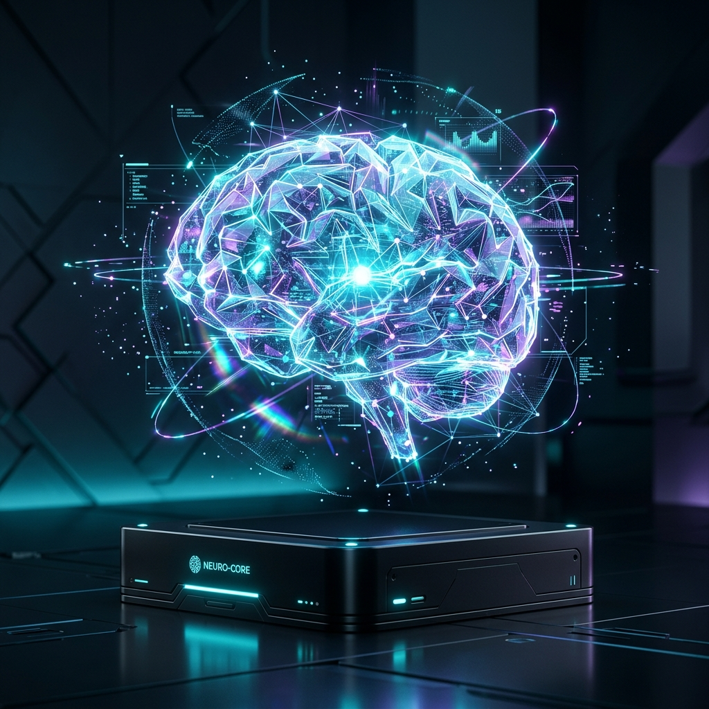
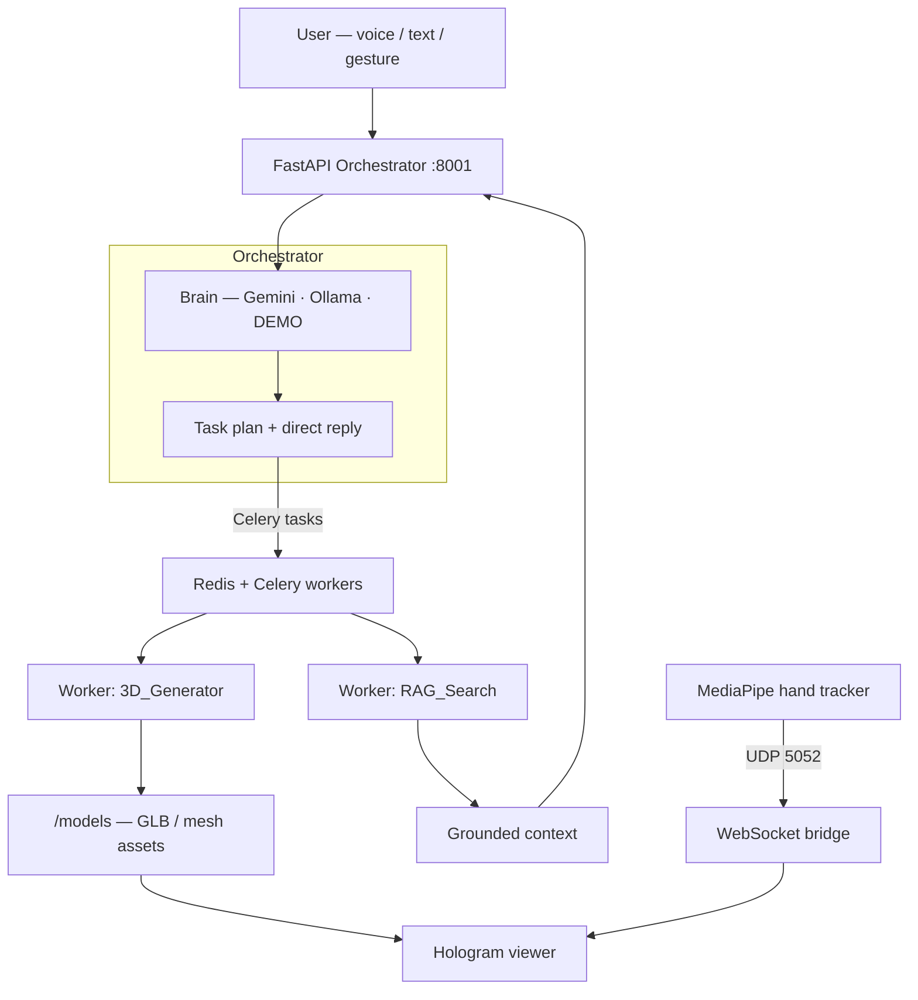

<div align="center">



<br><br>


# MILES
### Multimodal Intelligent Assistant for 3D Generation & Holographic Interaction

*Voice and gesture–controlled holographic AI — from a spoken request to a manipulable 3D asset.*

[IEEE Xplore](https://doi.org/10.1109/RMKMATE69073.2026.11518707) · [Author](https://github.com/kenzzhood)

</div>

---

## Overview

**MILES** (Multimodal Intelligent Assistant for 3D Model Generation and Holographic Interaction Using Voice and Gesture Control) is a research system that connects generative AI to physical, spatial interaction.

Traditional assistants are synchronous, screen-bound, and often hallucinate. MILES instead uses a **decoupled Orchestrator–Worker** design:

1. An LLM **orchestrator** turns a vague user request into a task plan (Chain-of-Thought).
2. Specialized **workers** run asynchronously (3D generation, web research / RAG).
3. Generated assets appear on a **Pepper’s Ghost–style hologram** and can be manipulated with **MediaPipe hand tracking** (pinch, rotate, scale).

Published at **IEEE RMKMATE 2026**.

---

## Key features

| Capability | What it does |
| :--- | :--- |
| **Orchestrator “brains”** | Swappable planners: Gemini API, local Ollama (`llama3.1:8b`), or a deterministic `DEMO` mock. |
| **Async worker pool** | Celery + Redis dispatch `3D_Generator` and `RAG_Search` without blocking the chat loop. |
| **On-demand 3D generation** | Text / image → generative 3D pipeline (SF3D / TripoSR path) serving meshes to the UI. |
| **Grounded answers** | RAG via live web research (Tavily) to reduce hallucinations. |
| **Holographic display** | Browser hologram viewer (`/ui/hologram.html`) with WebSocket model loading. |
| **Gesture control** | MediaPipe Hands → UDP `5052` → WebSocket bridge for pinch / transform mapping. |
| **Chat playground** | Static web UI at `/ui/` for interactive prompts and task streaming (SSE). |

---

## Architecture


```mermaid
graph TD
    User["User — voice / text / gesture"] --> API["FastAPI Orchestrator :8001"]

    subgraph Orchestrator
        Brain["Brain — Gemini · Ollama · DEMO"]
        Plan["Task plan + direct reply"]
        Brain --> Plan
    end

    API --> Brain
    Plan -->|Celery tasks| Queue["Redis + Celery workers"]

    Queue --> Gen3D["Worker: 3D_Generator"]
    Queue --> RAG["Worker: RAG_Search"]

    Gen3D --> Models["/models — GLB / mesh assets"]
    RAG --> Memory["Grounded context"]

    Models --> Holo["Hologram viewer"]
    Hands["MediaPipe hand tracker"] -->|UDP 5052| Bridge["WebSocket bridge"]
    Bridge --> Holo
    Memory --> API
```

**Request flow**

1. `POST /api/v1/interact` — orchestrator decomposes the prompt.
2. Tasks are queued; client polls `GET /api/v1/tasks/{id}` or streams `GET /api/v1/stream/{id}`.
3. Completed meshes are served under `/models` and pushed to the hologram display.
4. Hand tracker runs as a separate process; gestures update the live hologram scene.

---

## Repository layout

```text
MILES/
├── src/
│   ├── main.py                 # FastAPI app + lifespan (SF3D + UDP bridge)
│   ├── config.py               # BRAIN_MODE, API keys, Redis URLs
│   ├── api/
│   │   ├── endpoints.py        # /interact, /tasks, /stream
│   │   └── hologram_websocket.py
│   ├── orchestrator/           # Gemini / Ollama / mock brains
│   ├── workers/                # Celery app + 3D + RAG tasks
│   ├── services/               # hand_tracker, SF3D, image gen
│   └── web/                    # Chat UI + hologram viewer
├── models/                     # Generated assets
├── scripts/                    # Research / utility helpers
├── start_miles.bat             # Windows one-shot launcher
└── requirements.txt
```

---

## Tech stack

| Layer | Stack |
| :--- | :--- |
| API | FastAPI, Uvicorn, Pydantic |
| Orchestration | Gemini / Ollama / DEMO brains |
| Async jobs | Celery, Redis |
| 3D | Torch, Transformers, rembg, Trimesh, SF3D / TripoSR |
| Research | Tavily, requests |
| Interaction | MediaPipe Hands, OpenCV, WebSocket, UDP |
| Frontend | Static HTML/JS hologram + chat UI |

---

## Quick start

### Prerequisites

- Python **3.10+**
- **Redis** running locally (`localhost:6379`)
- Webcam (for gesture control)
- API keys (depending on brain mode):
  - `GEMINI_API_KEY` (or `GEMINI_API_KEYS`)
  - `TAVILY_API_KEY`
  - optional `HUGGINGFACE_API_TOKEN`

### Install

```bash
git clone https://github.com/kenzzhood/MILES.git
cd MILES

python -m venv .venv
source .venv/bin/activate   # Windows: .venv\Scripts\activate

pip install -r requirements.txt
```

### Configure

Create `src/.env`:

```env
GEMINI_API_KEY=your_gemini_key
TAVILY_API_KEY=your_tavily_key
HUGGINGFACE_API_TOKEN=optional_hf_token
```

In `src/config.py`, set the orchestrator mode:

```python
BRAIN_MODE = "GEMINI"   # or "LOCAL" or "DEMO"
```

For `LOCAL`, pull a model first:

```bash
ollama run llama3.1:8b
```

### Run (recommended — three processes)

**1. Celery worker**

```bash
celery -A src.workers.celery_app worker --loglevel=info -P solo
```

**2. Hand tracker** (gesture → hologram)

```bash
python -m src.services.hand_tracker
```

**3. API + web UI**

```bash
uvicorn src.main:app --host 0.0.0.0 --port 8001 --reload
```

On Windows you can also use:

```bat
start_miles.bat
```

### Open the UI

| Surface | URL |
| :--- | :--- |
| Health check | http://localhost:8001/ |
| Chat playground | http://localhost:8001/ui/ |
| Hologram viewer | http://localhost:8001/ui/hologram.html |

---

## API

### `POST /api/v1/interact`

Accepts a user prompt, returns a plan, optional direct reply, and Celery task IDs.

```bash
curl -X POST http://localhost:8001/api/v1/interact \
  -H "Content-Type: application/json" \
  -d '{"prompt": "Generate a holographic model of a vintage camera"}'
```

### `GET /api/v1/tasks/{task_id}`

Poll worker status / result.

### `GET /api/v1/stream/{task_id}`

Server-Sent Events progress stream for long-running 3D / research jobs.

---

## Gesture & hologram pipeline

1. `hand_tracker` captures webcam frames with **MediaPipe Hands** (adaptive pinch, debounce, crowd filter).
2. Landmarks are sent over **UDP** to `127.0.0.1:5052`.
3. FastAPI’s hologram bridge fans updates out to connected **WebSocket** displays.
4. The hologram page loads generated meshes and applies live transforms from pinch / hand motion — designed for Pepper’s Ghost setups (HoloInteract).

---

## Publication

**MILES: Multimodal Intelligent Assistant for 3D Model Generation and Holographic Interaction Using Voice and Gesture Control**

Goutham Srinath Karel Marx, Jeeva Karthikeyan, Dr. Sreeji S  
Sathyabama Institute of Science and Technology  
**IEEE RMKMATE 2026** · [doi:10.1109/RMKMATE69073.2026.11518707](https://doi.org/10.1109/RMKMATE69073.2026.11518707)

```bibtex
@inproceedings{miles2026,
  title     = {MILES: Multimodal Intelligent Assistant for 3D Model Generation and Holographic Interaction Using Voice and Gesture Control},
  author    = {Karel Marx, Goutham Srinath and Karthikeyan, Jeeva and S, Sreeji},
  booktitle = {IEEE RMKMATE},
  year      = {2026},
  doi       = {10.1109/RMKMATE69073.2026.11518707}
}
```

---

## Notes

- Treat API keys as secrets — keep them in `src/.env`, never commit real credentials.
- 3D generation is GPU-friendly; CPU-only runs will be slow.
- Redis must be up before Celery workers can process tasks.
- Demo / research prototype — paths and worker names may evolve as the worker pool expands.

---

<div align="center">

Built for immersive human–AI collaboration — from prompt to hologram.

</div>
